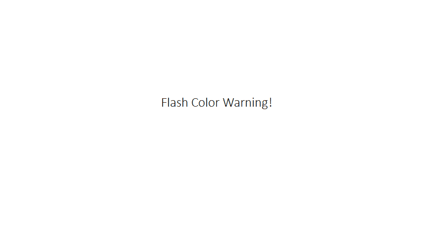

## Color Factory
- Start at a form that lets you pick a color. Once submitted a square of the color will appear.
- Clicking on the square will render a page with a background color of that chosen color!
- App Preview at the bottom due to potential color flashing sensitivity. 
- use react-router-dom to integrate Route, Link, Redirects, useParams
  

# Getting Started with React Card Drawing App

Uses state, useEffect, and useRef hooks to trigger a card to draw from an API deck when a button is clicked.

This project was bootstrapped with [Create React App](https://github.com/facebook/create-react-app).
Learned the usage of useEffect and useRef

## Available Scripts

In the project directory, you can run:

### `npm start`

Runs the app in the development mode.\
Open [http://localhost:3000](http://localhost:3000) to view it in the browser.

The page will reload if you make edits.\
You will also see any lint errors in the console.

### `npm test`

Launches the test runner in the interactive watch mode.\
See the section about [running tests](https://facebook.github.io/create-react-app/docs/running-tests) for more information.

# App Preview
